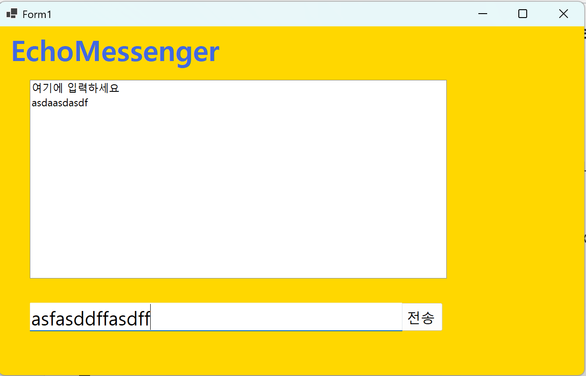
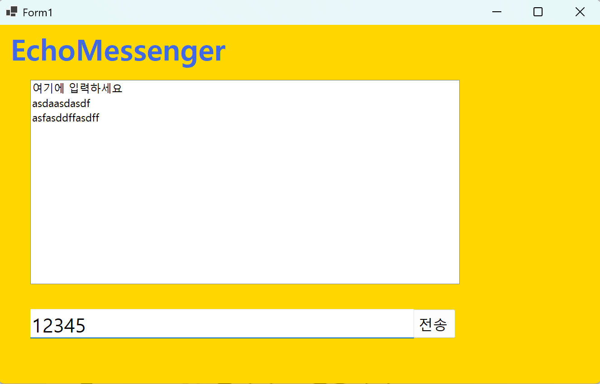
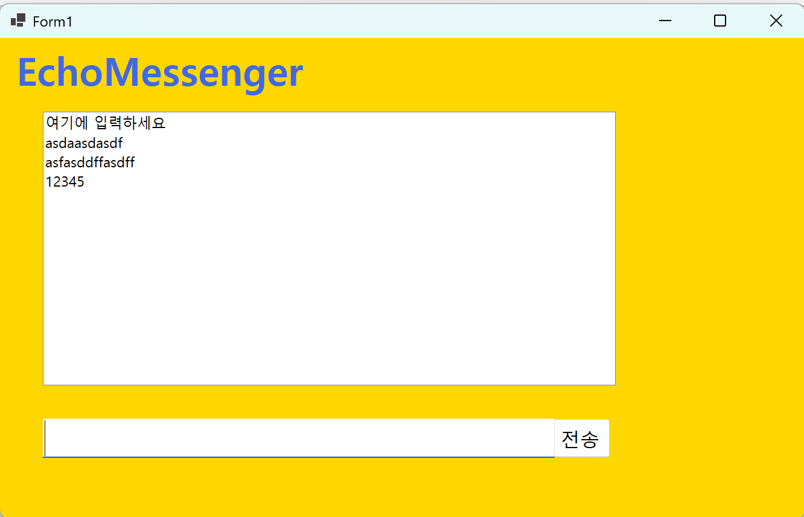
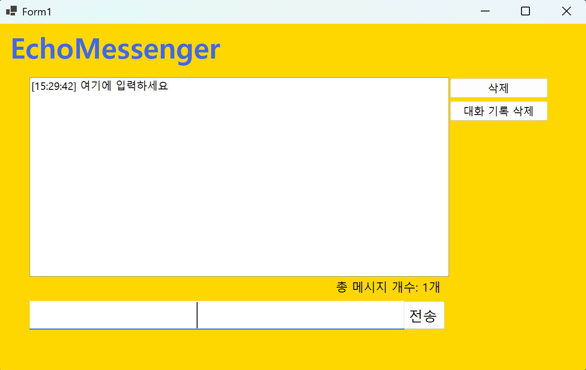
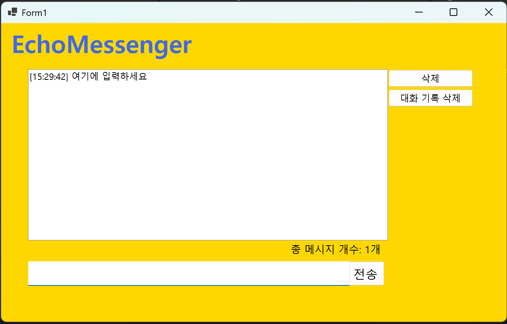
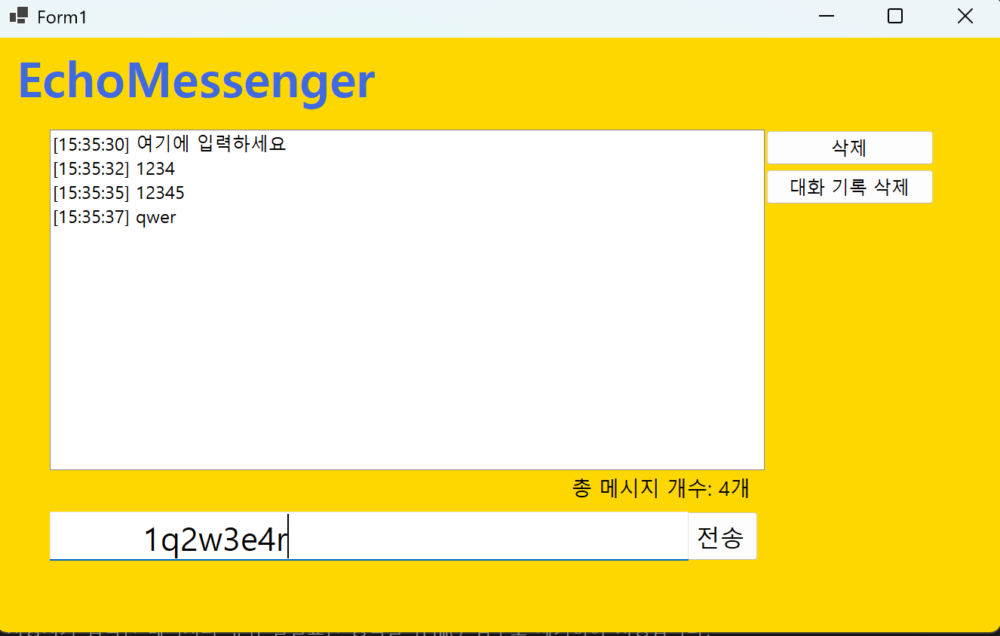
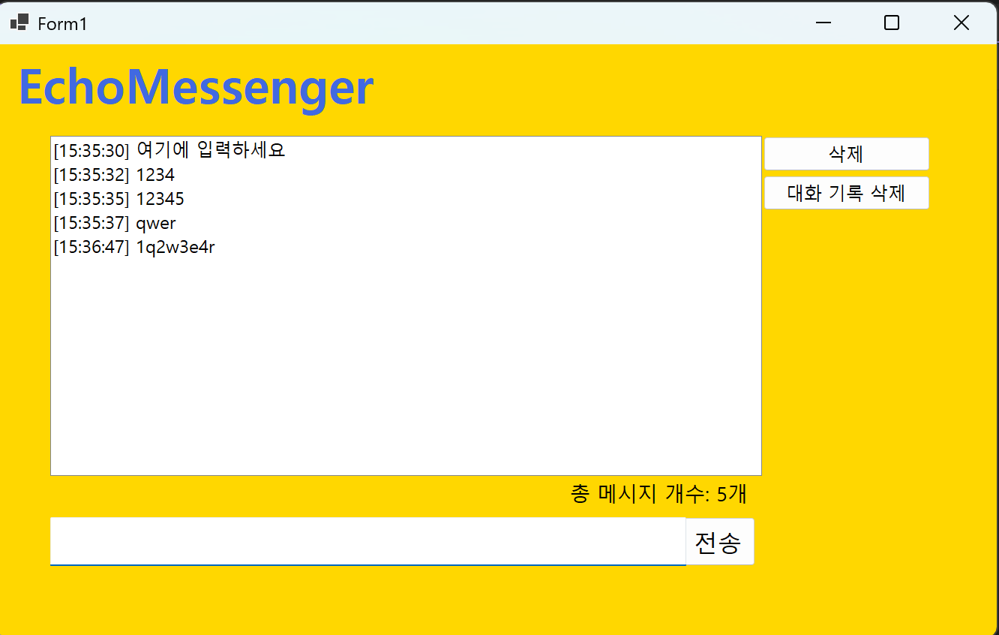

# (C# 코딩) 에코 메신저

## 개요
- C# 프로그래밍 학습
- 1줄 소개: 사용자 키보드 입력을 받아서 처리하는 프로그램
- 사용한 플랫폼
	- C#, .NET Windows Forms, Visual Studio, Github
- 사용한 컨트롤:
	Label, TextBox, ListBox, Button, KeyDown 
- 사용한 기술과 구현한 기능:

## 실행 화면 (과제1)
-과제 1 코드의 실행 스크린샷 

-과제 내용
 -Label(표시), TextBox(입력), Button(전송), ListBox(대화창)를적절히배치합니다.
 -전송버튼클릭시TextBox의텍스트를ListBox의항목(Items)으로추가합니다.
 -추가직후TextBox의내용을비워(Clear) 다음입력을준비합니다.

-구현 기능과 내용 설명
-입력창에메시지입력하고전송버튼을누르면메시지가리스트박스에표시된다.
-계속반복하면메시지가리스트박스에한줄씩계속추가된다.
-추가내용이많아지면리스트박스에스크롤바가자동으로생기고스크롤된다

## 실행 화면 (과제2)
-과제 2 코드의 실행 스크린샷 

-과제 내용
 -전송이 끝나면 입력창에 남겨진 기존 메시지를 삭제합니다.
 -전송 후에 마우스로 입력창을 다시 클릭하지 않아도 되도록 커서를 자동으로 입력창에 둡니다.
 -마우스 클릭 대신 키보드의 Enter 키를 눌러도 메시지가 전송되도록 합니다.
 -내용이 없는 빈 문자열이나 공백(Space)만 있을 때에는 메시지가 전송되지 않도록 방지합니다.
-구현 기능과 내용 설명
 -입력 후에 입력창에 마우스 커서가 자동으로 위치하여 다음 메시지를 바로 입력할 수 있다.
 -키보드의 Enter 키를 눌러도 메시지가 전송된다.
 -공백을 입력하면 메시지가 전송되지 않고 입력창이 초기화된다.

## 실행 화면 (과제3)
-과제 3 코드의 실행 스크린샷

-과제 내용
 -메시지 앞에 현재시간([14:20:05])을 자동으로 결합하여 리스트에 출력합니다.
 -현재 리스트에 쌓인 총 메시지 개수를 계산하여 하단 Label에 실시간으로 업데이트합니다. 
 -사용자가 입력한 메시지의 앞뒤 불필요한 공백을 Trim() 함수로 제거하여 저장합니다.

-구현 기능과 내용 설명
 -메시지 앞에 시간이 결합된다.
 -총 메시지 개수가 출력된다.
 -불필요한 공백이 제거된 채로 입력된다.

## 실행 화면 (과제4)
-과제 4 코드의 실행 스크린샷

-과제 내용

-구현 기능과 내용 설명